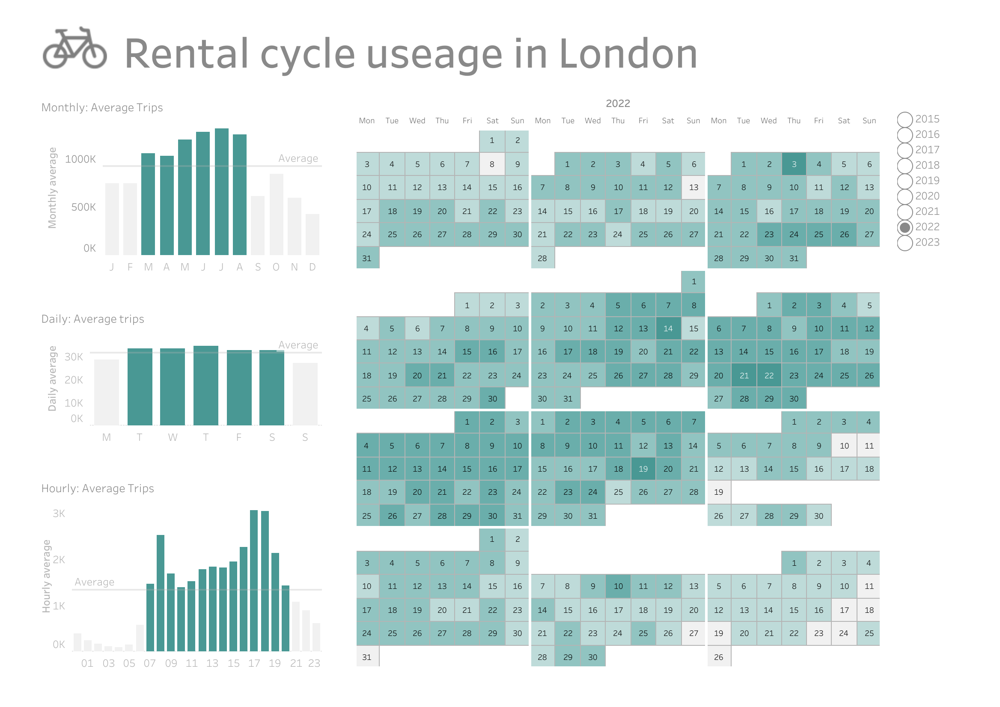

# london-bicycles project in SQL
## Overview
This project uses the london_bicycles public dataset on BigQuery. I used SQL to query the dataset and gather insights about bike useage in London. 

The questions I asked of the data were:
1. What is the most popular cycle station?
2. What are the characteristics of the most popular journeys?
3. How does bike useage change over time?
4. How much time are bikes spent unused?

I used my time_trends csv as a datasource in Tableau and built a dashboard to show the patterns of bike useage across each year with averages for months, weeks and hours of the day. 
You can [view the dashboard in full and download the workbook](https://public.tableau.com/app/profile/kat4197/viz/london_bicycles_time_trends/Rentalcycleuseage) from tableau public.

   
## Dataset
The london_bicycles public dataset on BigQuery contains two tables (cycle_hires and stations) and has data for all rides between 2015 and 2022. 

## Project use
* Copy the SQL queries into BigQuery to run them
* Download the csv files for output of queries (except 'date query' as csv is too large to upload)
* View the dashboard in full and download the Tableau workbook from [tableau public.](https://public.tableau.com/app/profile/kat4197/viz/london_bicycles_time_trends/Rentalcycleuseage)

## Acknowledgements
BigQuery for providing the london_bicycles public dataset.
